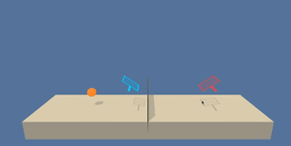
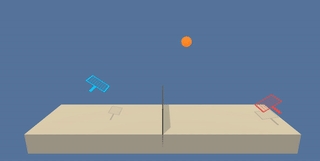

# rl-tennis

### Introduction

In this project, [MADDPG](https://arxiv.org/pdf/1706.02275.pdf) algorithm is implemented to train agents in the [Tennis](https://github.com/Unity-Technologies/ml-agents/blob/master/docs/Learning-Environment-Examples.md#tennis) environment.  The following figure demonstrates the effect of training our agents on the environment.

Random Tennis Agent         |  MADDPG Tennis Agents
:-------------------------:|:-------------------------:
  |  

In this environment, our aim is to train agents to bounce a ball to opponents area. These agents can control their rackets. If they successfully bounce the ball in that way, they are rewarded by +0.1. Otherwise, they get a negative reward which is -0.01. So, the aim of a game is not to let the ball hit the ground.

These agents receive local observations with 8 variables about the position and velocity of the ball and racket. And, they have 2 actions which are continuous: horizontal and vertical axes.

### Termination Criteria
This task is episodic. Thus, it is solved when our agents get an average score more than 0.5. That average scores is calculated by averaging scores the previous 100 episodes. A score of an episode is the maximum of agents scores.

### Getting Started

At first, we should set up out python environment via following the instructions in [here](https://github.com/udacity/deep-reinforcement-learning#dependencies)

Secondly, we should obtain the environment. You do not have to install Unity but the Tennis environment. Please download and extract the appropriate version, then place it in the path of the Jupyter notebook. You can download the environment by the following steps.

1. Download the environment from one of the links below.  You need only select the environment that matches your operating system:
    - Linux: [click here](https://s3-us-west-1.amazonaws.com/udacity-drlnd/P3/Tennis/Tennis_Linux.zip)
    - Mac OSX: [click here](https://s3-us-west-1.amazonaws.com/udacity-drlnd/P3/Tennis/Tennis.app.zip)
    - Windows (32-bit): [click here](https://s3-us-west-1.amazonaws.com/udacity-drlnd/P3/Tennis/Tennis_Windows_x86.zip)
    - Windows (64-bit): [click here](https://s3-us-west-1.amazonaws.com/udacity-drlnd/P3/Tennis/Tennis_Windows_x86_64.zip)
    
    (_For Windows users_) Check out [this link](https://support.microsoft.com/en-us/help/827218/how-to-determine-whether-a-computer-is-running-a-32-bit-version-or-64) if you need help with determining if your computer is running a 32-bit version or 64-bit version of the Windows operating system.

    (_For AWS_) If you'd like to train the agent on AWS (and have not [enabled a virtual screen](https://github.com/Unity-Technologies/ml-agents/blob/master/docs/Training-on-Amazon-Web-Service.md)), then please use [this link](https://s3-us-west-1.amazonaws.com/udacity-drlnd/P3/Tennis/Tennis_Linux_NoVis.zip) to obtain the "headless" version of the environment.  You will **not** be able to watch the agent without enabling a virtual screen, but you will be able to train the agent.  (_To watch the agent, you should follow the instructions to [enable a virtual screen](https://github.com/Unity-Technologies/ml-agents/blob/master/docs/Training-on-Amazon-Web-Service.md), and then download the environment for the **Linux** operating system above._)

2. Place the file in the DRLND GitHub repository, in the `p3_collab-compet/` folder, and unzip (or decompress) the file. 

### Instructions

Follow the instructions in `Tennis.ipynb` to get started with training your own agent!  

## Using a pretrained version
If you are impatient, then you may use the pre-trained model parameters in the repository named trained_actor_a<0,1>.pt. All you need to do is to set USE_PRETRAIN variable to True. This variable can be found in the second cell in Tennis.ipynb notebook.

If you are struggle to work on this project, please just open an issue. Look forward to hear about your nice experiences!
