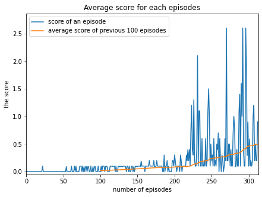

#Project Report

### Introduction

In this project, [MADDPG](https://arxiv.org/pdf/1706.02275.pdf) algorithm is implemented to train agents in the environment named [Tennis](https://github.com/Unity-Technologies/ml-agents/blob/master/docs/Learning-Environment-Examples.md#tennis) environment.  The following figure demonstrates the effect of training our agents on the environment.

Random Tennis Agent         |  MADDPG Tennis Agents
:-------------------------:|:-------------------------:
  |  

### Environment, States, and Actions
Unity's ML Agents package is utilized in the project to train the agent on the environment named Tennis. In this environment, 
there are 2 rackets placed on the platform. These rackets are controlled by 2 agents which perceive a 24-dimensional vector of 3 timesteps as its own local state to keep information of the position and velocity of the ball and racket. And, the action made in each step is 2-dimensional continus variables for horizontal and vertical moves. 

#### The Goal and Rewards
In this environment, our aim is to train agents to bounce a ball to opponents area. These agents can control their rackets. If they successfully bounce the ball in that way, they are rewarded by +0.1. Otherwise, they get a negative reward which is -0.01. So, the aim of a game is not to let the ball hit the ground.

#### Termination Criteria
This task is episodic. Thus, it is solved when our agents get an average score more than 0.5. That average scores is calculated by averaging scores the previous 100 episodes. A score of an episode is the maximum of agents scores.

### Methodology
The MADDPG is an algorithm in which there are 2 artificial neurol networks for each agent: actor and critic. It can bee too complex depending on a task. In this project, we keep it simple since our environment provides us state values in 24-dimensional space. 
It is implemented by using **Pytorch** and **Python 3**. The neural network architecture of **Actor** has 2 fully connected layers(64 and 128 units) followed by ReLu actiovations except the last layer(tanh activation) which outcomes a 2-dimensional vector for an action.
The neural network architecture of **Critic** has 2 fully connected layers(64 and 128 units) followed by ReLu actiovations except the last layer which outcomes a Q-value. In this network, representaions of the first hidden layer are concataned to action values of Actor network. Then, they are fed to the second hidden layer. Adam optimizer is selected for both neural networks.

  - Replay Buffer: Our agent takes actions orderly. Therefore, probability of selecting the next action may be affected by the previous one. To eliminate this correlation effect we utilize the replay buffer which is a fixed size buffer to store experiences. We have 2 agents with different networks but they share the same replay buffer.
  - Fixed Targets: Two identical Actor and Critic Networks are created for the agent: a local and a target. The target network is softly updated for 10 times after every 2 steps with parameters of the local network. In this way, similar to replay buffer, we can decrease correlation among selection of actions. 

These techniques are utilized to train our Tennis agents. Due to simplicity of the input state and the network we mentioned above, we prefer to use CPU in order to train our agent.

### Results
We used the hyperparameters as the following:

  - BUFFER_SIZE = int(1e5)  # replay buffer size
  - BATCH_SIZE = 128        # minibatch size
  - GAMMA = 0.99            # discount factor
  - TAU = 2e-3              # for soft update of target parameters
  - LR_ACTOR = 1e-3         # learning rate of the actor 
  - LR_CRITIC = 1e-3        # learning rate of the critic
  - WEIGHT_DECAY = 0        # L2 weight decay
  - SIGMA_DECAY = 0.995     # Noise decay for sigma
  - SIGMA_MIN = 0.005       # Minimum parameter for sigma
  - LEARN_EVERY = 2         # how frequently are agents updated
  - UPDATE_STEPS = 10       # how many times are agents trained when they are selected for being updated

Our agent is capable of solving the task after the episode **313**. The result of the MADDPG algorithm is the following:  

  > Episode 100	Average Score: 0.02  
  Episode 200	Average Score: 0.08   
  Episode 300	Average Score: 0.46   
  Episode 313	Average Score: 0.50 Environment is solved.   
  
  
The average score value is calculated by averaging average scores of 20 agents in the last 100 episodes.

  

### Conclusion
The followings can be done as a future work:

  - Grid search can be applied to find the optimum hyperparameters
  - PPO, A3C, and D4PG approaches can be implemented.
  - This task can be converted to a pixel-wise one so that a new deep learning model can be trained on that.
